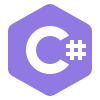

<div align="center">
     


<a href="https://github.com/AkiriVsev">
  
</a>

<br>


</div>

<p align="center">⚙️ ✦ ⚙️ ✦ ⚙️ ✦ ⚙️ ✦ ⚙️</p>

## ⚙️ About This Engineer

> *"Every great machine starts as a rough sketch — and every good developer starts as a curious beginner."*

Front-end developer based in **Ukraine**, on a hands-on, self-taught path into software engineering. Over the past two years I've built a solid foundation in modern web development — working steadily through project-based courses and turning theory into real, working code. I'm currently deepening my stack with **React, TypeScript, and Node.js**, with the goal of growing into a well-rounded front-end (and eventually full-stack) engineer.

Outside of code, I study **graphic design, 3D graphics, and video editing** — creative disciplines that sharpen my eye for layout, detail, and motion, and that I bring directly into the interfaces I build. I care about clean, maintainable code, I learn in public, and I'm actively looking for opportunities to put what I've built so far to work on real, meaningful projects.

```js
const seva = {
  role: "Front-end Developer",
  location: "Ukraine",
  age: 19,
  currentFocus: ["React", "TypeScript", "Node.js"],
  alsoExploring: ["Graphic Design", "3D Graphics", "Video Editing"],
  motto: "Build it clean. Build it once. Keep the gears turning. ⚙️",
};
```

<p align="center">⚙️ ✦ ⚙️ ✦ ⚙️ ✦ ⚙️ ✦ ⚙️</p>

## 🗣️ Languages

<div align="center">

| Language | Level |
|---|---|
| Ukrainian | Native |
| English | Intermediate |

</div>

<p align="center">⚙️ ✦ ⚙️ ✦ ⚙️ ✦ ⚙️ ✦ ⚙️</p>

## 🔧 Core Machinery — Tools I Already Wield

<p align="center">Small toolkit, strong fundamentals — the parts I already know how to assemble.</p>

<table align="center">
  <tr>
    <td align="center" width="90">
      
      <br>HTML 5
    </td>
    <td align="center" width="90">
      
      <br>CSS 3
    </td>
    <td align="center" width="90">
      
      <br>JavaScript
    </td>
    <td align="center" width="90">
      
      <br>Git
    </td>
    <td align="center" width="90">
      
      <br>NodeJS
    </td>
  </tr>
</table>

## 🔩 Blueprints in Progress — What I'm Building Toward

<details>
<summary><b>📜 Click to unroll the schematic</b></summary>
<br>

<table align="center">
  <tr>
    <td align="center" width="90"><br>MySQL</td>
    <td align="center" width="90"><br>React</td>
    <td align="center" width="90"><br>Angular</td>
    <td align="center" width="90"><br>Sass</td>
    <td align="center" width="90"><br>TypeScript</td>
    <td align="center" width="90"><br>PHP</td>
    <td align="center" width="90"><br>Redux</td>
    <td align="center" width="90"><br>C++</td>
  </tr>
  <tr>
    <td align="center" width="90"><br>BEM</td>
    <td align="center" width="90"><br>C</td>
    <td align="center" width="90"><br>C#</td>
    <td align="center" width="90"><br>jQuery</td>
    <td align="center" width="90"><br>Python</td>
    <td align="center" width="90"><br>Vue JS</td>
    <td align="center" width="90"><br>Webpack</td>
    <td align="center" width="115"><br>Tailwind CSS</td>
  </tr>
</table>

</details>

<p align="center">⚙️ ✦ ⚙️ ✦ ⚙️ ✦ ⚙️ ✦ ⚙️</p>

## 🏗️ Featured Projects

**[Coursework](https://github.com/AkiriVsev/Coursework)** — a university coursework project: a student-list management site with dynamic editing, built in vanilla JavaScript to practice DOM manipulation and CRUD-style logic.

**[WebStudio](https://github.com/AkiriVsev/WebStudio)** — a personal training ground for front-end fundamentals, combining HTML, CSS, JavaScript, and Bootstrap into portfolio-ready pages.


<p align="center">⚙️ ✦ ⚙️ ✦ ⚙️ ✦ ⚙️ ✦ ⚙️</p>

## 📊 The Engine Room — GitHub Stats

<div align="center">

</div>

<div align="center">

</div>

<p align="center">⚙️ ✦ ⚙️ ✦ ⚙️ ✦ ⚙️ ✦ ⚙️</p>

## 🐍 The Mechanical Serpent

A small automaton that crawls across my contribution grid and devours every square I've filled in — a self-updating piece of kinetic art for the workshop wall, redrawn automatically every 12 hours.

<div align="center">
<picture>
  <source media="(prefers-color-scheme: dark)" srcset="https://raw.githubusercontent.com/AkiriVsev/AkiriVsev/output/github-snake-dark.svg"/>
  <source media="(prefers-color-scheme: light)" srcset="https://raw.githubusercontent.com/AkiriVsev/AkiriVsev/output/github-snake.svg"/>
  
</picture>
</div>

<p align="center">⚙️ ✦ ⚙️ ✦ ⚙️ ✦ ⚙️ ✦ ⚙️</p>

## 📡 Get In Touch

<div align="center">
<a href="t.me/Xasteo"></a>
<a href="demcooskme@gmail.com"></a>
<a href="https://www.linkedin.com/in/%D0%B2%D1%81%D0%B5%D0%B2%D0%BE%D0%BB%D0%BE%D0%B4-%D0%B7%D0%B0%D0%B9%D1%86%D0%B5%D0%B2-178857413/"></a>
<a href="https://www.instagram.com/xasteo_?igsh=MXFzb2plcng3aHY3NA=="></a>
</div>


